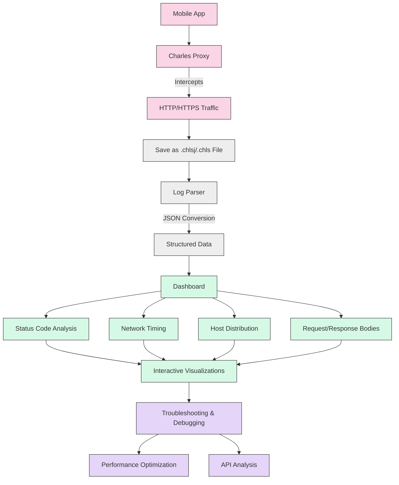

# MCP-Charles Flow Diagram

This document describes the data flow in the MCP-Charles system, from traffic capture to analysis.

## Diagram

## Flow Description

The MCP-Charles workflow consists of several stages:

### 1. Data Capture
- **Mobile App**: The source of network traffic
- **Charles Proxy**: Intercepts HTTP/HTTPS traffic from the mobile app
- **Traffic Capture**: Records all requests and responses passing through the proxy

### 2. Log Generation
- Traffic is saved as `.chls` (Charles Session) or `.chlsj` (Charles Session JSON) files
- These files contain detailed information about requests and responses including:
  - URLs
  - Headers
  - Request bodies
  - Response bodies
  - Timing information

### 3. Data Processing
- **Log Parser**: Processes the raw log files 
- **JSON Conversion**: Transforms the data into a structured, standardized JSON format
- **Data Preparation**: Organizes and optimizes data for visualization and analysis

### 4. Visualization
- **Dashboard**: Presents the data in an interactive interface
- **Analysis Categories**:
  - Status Code Analysis: Distribution of HTTP status codes (200, 404, 500, etc.)
  - Network Timing: Request duration, time to first byte, etc.
  - Host Distribution: Top domains and endpoints
  - Request/Response Bodies: Detailed view of payloads

### 5. Analysis
- **Interactive Visualizations**: Allow filtering, sorting, and detailed inspection of data
- **Troubleshooting & Debugging**: Identify errors and unexpected behavior
- **Performance Optimization**: Analyze response times and identify bottlenecks
- **API Analysis**: Understand API structure, parameters, and behavior

## Usage Scenarios

1. **Mobile App Development**:
   - Debug network issues
   - Validate API requests and responses
   - Optimize network calls

2. **QA Testing**:
   - Verify correct data flow
   - Test error handling
   - Document API behavior

3. **Performance Analysis**:
   - Identify slow requests
   - Find opportunities for caching
   - Analyze payload sizes

4. **Security Testing**:
   - Inspect authentication flows
   - Review data being transmitted
   - Check for sensitive information in requests/responses 